# ARCHITECTURE.md — URBANEYE Locked System Architecture

## 1. System Vision
URBANEYE is a software-first centralized urban intelligence platform developed for Smart India Hackathon 2026 (Problem Statement ID: 26124). It turns city public transport bus fleets into mobile real-time sensor grids, automatically identifying road damage, waterlogging, damaged signage, and traffic bottlenecks without deploying expensive static road sensor infrastructure.

---

## 2. End-to-End Data Pipeline

```mermaid
flowchart TD
    subgraph FleetSensing["Fleet Sensing Layer (Mobile Cameras & GPS)"]
        Bus1["Bus #1 (Route 335E)"]
        Bus2["Bus #2 (Route 500D)"]
        BusN["Bus #N (Fleet GPS/Dashcam)"]
    end

    subgraph AIProcessing["AI Processing Layer"]
        PotholeMod["Pothole Detector (YOLO/Custom)"]
        WaterlogMod["Waterlogging Segmentation"]
        SignMod["Signage Damage Classifier"]
        TrafficMod["Vehicle Counter & Density Flow"]
    end

    subgraph StandardContract["Ingestion Boundary"]
        EventJSON["Standard Event JSON Payload (Base + Domain Data)"]
    end

    subgraph BackendLayer["FastAPI + PostGIS Backend"]
        FastAPIIngest["FastAPI Ingestion Endpoint (/api/v1/events)"]
        CorroborationEngine["Multi-Bus Corroboration & Scoring Engine"]
        PostgresDB[("PostgreSQL 16 + PostGIS Spatio-temporal DB")]
        WebSocketServer["WebSocket Stream Manager (/ws/live)"]
    end

    subgraph FrontendApp["URBANEYE Frontend (React + Vite + MapLibre)"]
        CmdCenter["Command Center (Overview & Triage)"]
        LiveGIS["Live GIS (MapLibre Geospatial Layers)"]
        TrafficView["Traffic Analytics (Recharts Flow & Speeds)"]
        RoadIntel["Road Intelligence (Hazard Inventory)"]
        AlertCenter["Alert Center (Escalations & Tickets)"]
        FleetView["Fleet (Bus Telemetry & Health)"]
    end

    subgraph MunicipalAction["Authority Action Layer"]
        PWD["PWD / Road Repair Work Orders"]
        TrafficPolice["Traffic Control Room Notifications"]
        Drainage["Municipal Drainage Maintenance"]
    end

    FleetSensing --> AIProcessing
    AIProcessing --> EventJSON
    EventJSON --> FastAPIIngest
    FastAPIIngest --> CorroborationEngine
    CorroborationEngine --> PostgresDB
    PostgresDB --> WebSocketServer
    PostgresDB --> FastAPIIngest
    WebSocketServer --> FrontendApp
    FastAPIIngest --> FrontendApp
    FrontendApp --> MunicipalAction
```



---

## 3. Core Differentiators

### A. Multi-Bus Corroboration
Instead of raising immediate unverified alerts upon a single AI detection (which risks false positives from glare, debris, or shadows), URBANEYE groups detections by spatio-temporal proximity (e.g. radius $\le 15\text{m}$, time window $\le 6\text{ hours}$).
- **Single Bus Detection**: `Unverified` (Confidence score $\times 0.7$)
- **2+ Distinct Buses**: `Corroborated` (Confidence elevated to 95%+, auto-promoted to alert triage)
- **3+ Distinct Buses**: `Critical Confirmed` (Auto-escalation candidate)

### B. Action & Priority Scoring Algorithm
Priority scores are dynamically computed from 0 to 100:
$$\text{Priority Score} = (\text{Severity Weight} \times 0.40) + (\text{Corroboration Count} \times 0.25) + (\text{Traffic Density} \times 0.20) + (\text{Confidence} \times 0.15)$$

### C. GIS-First Command View
Utilizing MapLibre GL JS with custom vector tiles, clustering, heatmaps, and geospatial filters to present actionable real-time spatial context.

### D. Offline Simulation / Demo Mode
The frontend contains an integrated high-fidelity mock stream generator allowing full end-to-end demonstrations without active backend dependencies.

---

## 4. Frontend Architecture & Boundaries

```
src/
├── assets/          # Static assets (logos, icons, map styles)
├── components/
│   ├── common/      # Reusable UI building blocks (KPICard, StatusBadge, AlertCard, etc.)
│   ├── gis/         # MapLibre map wrappers, layer controls, and popups
│   ├── layout/      # AppShell, TopHeader, Sidebar, Navigation
│   └── triage/      # Ticket generation and municipal action modals
├── hooks/           # Custom React hooks (useMap, useEventStream, useDebounce)
├── pages/           # Exactly 6 locked route pages
│   ├── CommandCenter.tsx
│   ├── LiveGIS.tsx
│   ├── TrafficAnalytics.tsx
│   ├── RoadIntelligence.tsx
│   ├── AlertCenter.tsx
│   └── Fleet.tsx
├── services/        # Isolated API & WebSocket communication layer
│   ├── api.ts
│   ├── websocket.ts
│   └── mockData.ts
├── store/           # Zustand state management
│   ├── useEventStore.ts
│   ├── useFilterStore.ts
│   ├── useFleetStore.ts
│   └── useSimulationStore.ts
└── types/           # Canonical TypeScript contracts
    └── events.ts
```
